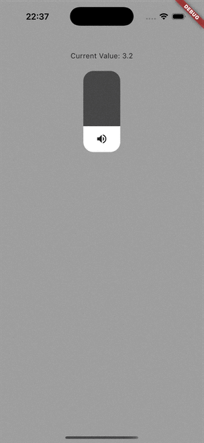

## ios_control_center_slider

An iOS Control Center–style vertical slider for Flutter. It mimics the iOS volume/brightness control with a tall rounded track, animated fill, and a contextual icon at the bottom.




---

## Features

- iOS Control Center–like appearance out of the box
- Vertical interaction with smooth updates
- Simple API: control via `currentValue` and `onChanged`

---

## Installation

Add the dependency in your `pubspec.yaml`:

```yaml
dependencies:
  ios_control_center_slider: ^0.0.1
```

Then run:

```bash
flutter pub get
```

---

## Usage

```dart
import 'package:flutter/material.dart';
import 'package:ios_control_center_slider/ios_control_center_slider.dart';

class VolumeExample extends StatefulWidget {
  const VolumeExample({super.key});

  @override
  State<VolumeExample> createState() => _VolumeExampleState();
}

class _VolumeExampleState extends State<VolumeExample> {
  double volume = 5.0; // Range: 0.0..10.0

  @override
  Widget build(BuildContext context) {
    return Scaffold(
      backgroundColor: Colors.grey.shade200,
      body: Center(
        child: IosControlCenterSlider(
          name: 'Volume',
          currentValue: volume,
          onChanged: (double value) {
            setState(() => volume = value);
          },
        ),
      ),
    );
  }
}
```

---

## API

```dart
IosControlCenterSlider({
  required double currentValue, // 0.0..10.0
  required String name,
  ValueChanged<double>? onChanged,
})
```

- `currentValue`: Current value (0.0 = empty, 10.0 = full).
- `onChanged`: Called whenever the slider value changes.
- `name`: Logical control name (reserved for future UI usage).

Notes:
- The control renders vertically using a rotated `Slider` under the hood.
- The bottom icon toggles between `volume_off` and `volume_up` based on value.

---

## Example app

See the `/example` folder for a runnable sample.

---

## Contributing

Issues and pull requests are welcome.
Repository: https://github.com/Manh-Dung/ios_control_center_slider
